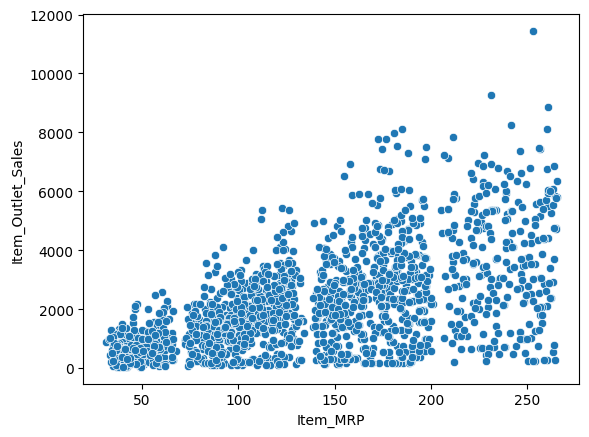

# Food Sales Predicitons
## An attempt to develop two different models that can predict item outlet sales

**Nassir**: 

### Business problem:

understand the properties of products and outlets that play crucial roles in increasing sales.

### Data:

This will be the dictionnary of the features included in this project

Item_Identifier: Unique product ID 

Item_Weight: Weight of product

Item_Fat_Content: Whether the product is low fat or regular

Item_Visibility: The percentage of total display area of all products in a store allocated to the particular product

Item_Type: The category to which the product belongs

Item_MRP: Maximum Retail Price (list price) of the product

Outlet_Identifier: Unique store ID

Outlet_Establishment_Year: The year in which store was established

Outlet_Size: The size of the store in terms of ground area covered

Outlet_Location_Type: The type of area in which the store is located

Outlet_Type: Whether the outlet is a grocery store or some sort of supermarket

Item_Outlet_Sales: Sales of the product in the particular store. This is the target variable to be predicted.

## Methods:
To make our sales predictions we tried Both linear Regression and Decision tree regressor and after comparing and evaluating we can easily conclude that the linear regression is the better one
To make sure we could get the best results from our models of course we spent some good time in data cleaning and data understanding

#### Maximum Retail Price to Outlet Sales

